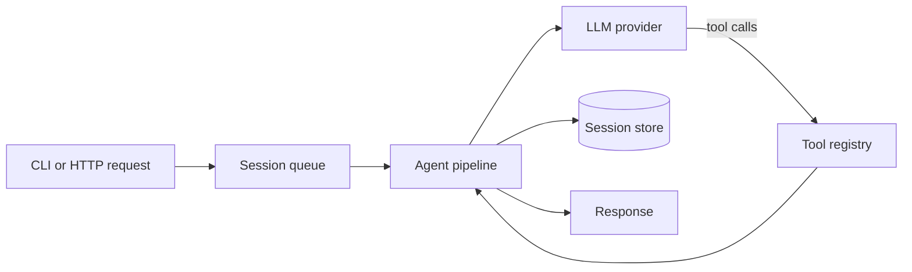

# Step 1 — Project Scope and Folder Structure

**Knowledge depth: 4/10**  

Start by reading [00 — Architecture Overview](../00-architecture-overview.md). Focus on the startup path, package responsibilities, and the boundary between a small agent core and GoClaw's larger platform.

GoClaw is not just an LLM wrapper. It is a multi-surface agent gateway: a request enters through a channel, CLI, HTTP, or WebSocket; a scheduler protects ordering; an agent pipeline calls a provider and tools; stores keep context and memory; results are delivered back through the original surface.

## The project we will build

This course follows GoClaw's boundaries but intentionally keeps the implementation suitable for a student project:

```text
One Go gateway + one React web UI
One OpenAI-compatible provider adapter
PostgreSQL with pgvector
One agent profile and per-user sessions
Conversation memory and a small tool set
HTTP API + WebSocket streaming
Structured logs and a simple run timeline
```

We will study channels, teams, multiple providers, skill publishing, scheduled autonomy, and multi-tenancy as GoClaw architecture. We will not implement them in this project. That keeps the system coherent instead of producing many incomplete integrations.

## Begin with a useful slice

Build this first:



Everything else is an extension of one of those arrows.

| Concern | Student-project version | GoClaw reference |
|---|---|---|
| Entry | HTTP, WebSocket, and a small CLI | `internal/http`, `internal/gateway`, `cmd` |
| Execution | one loop and queue per session | `internal/pipeline`, `internal/agent` |
| Model | one OpenAI-compatible provider | `internal/providers`, `internal/providerresolve` |
| State | agents, sessions, messages, memories, traces | `internal/store/session_store.go` |
| Action | memory search plus workspace file tools | `internal/tools` |
| Persistence | PostgreSQL + pgvector | `internal/store/pg`, `migrations/` |

## Read the real architecture in this order

```text
main.go
  cmd/root.go, cmd/gateway.go           process composition
  internal/gateway/server.go            HTTP + WebSocket boundary
  internal/agent/router.go              agent lookup/cache
  internal/agent/loop_pipeline_adapter.go
  internal/pipeline/pipeline.go         execution flow
  internal/providers/types.go           model-neutral contract
  internal/tools/types.go               tool contract
  internal/store/session_store.go       durable conversation contract
```

The current runtime is a pipeline. Its public comment names eight logical phases:

```text
context → history → prompt → think → act → observe → memory → summarize
```

In code, some phases are grouped: `ContextStage` prepares context/history/prompt; `ThinkStage` calls the model; `ToolStage` acts; `ObserveStage` records model output; pruning and checkpoint stages manage context and persistence.

## Separate core from platform features

This separation prevents a common failure: reproducing directories instead of reproducing behavior.

```text
Core agent
├── canonical messages
├── provider interface
├── bounded think → tool → observe loop
├── session persistence
└── tool authorization

GoClaw platform features studied but not implemented here
├── multi-tenancy / RBAC / encrypted credentials at platform scale
├── Telegram, Discord, WhatsApp, Feishu, Zalo, and other channels
├── MCP servers, OAuth, ACP, browser, sandbox, media, and TTS
├── teams, delegation, cron, and heartbeat
└── desktop client and self-evolving skills
```

## Architecture rules to adopt now

1. **Normalize at boundaries.** Providers and tools have vendor-specific shapes; the agent loop must not.
2. **Keep run state per run.** A shared loop object may hold dependencies, but messages, counters, spans, and cancellation must belong to the request.
3. **Serialize a session by default.** Two simultaneous turns on the same history cause incorrect answers and lost writes.
4. **Persist only durable facts.** Do not store socket connections, raw API secrets, or giant base64 media in message history.
5. **Use `context.Context` for scope and cancellation.** GoClaw propagates tenant, agent, user, locale, and workspace through context-aware stores.

As you create the folders, keep the architecture deliberately small: one process, one provider adapter, a durable store, and a narrow tool surface. The later steps grow this core into a complete web product.
