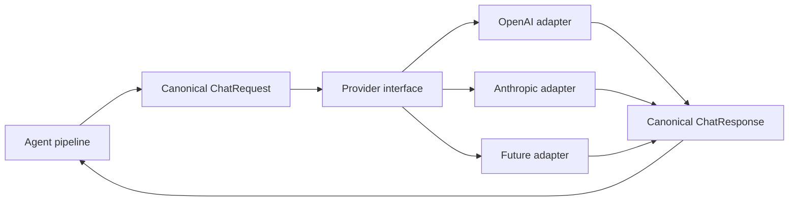

# Step 4 — LLM Provider Adapter

**Knowledge depth: 6/10**  

Read [02 — LLM Providers](../02-providers.md) carefully before choosing an API. This project implements one OpenAI-compatible adapter with streaming and tool calls. Refer to [12 — Extended Thinking](../12-extended-thinking.md) to understand provider reasoning controls; [18 — ACP Provider](../18-acp-provider.md) is architecture study only, not an integration to build here.

## Why this boundary matters

Providers disagree on request JSON, server-sent events, tool argument fragments, reasoning blocks, image fields, and whether tool calls can be streamed. Letting those differences into orchestration turns every new provider into a rewrite.

GoClaw keeps the agent-facing contract in `internal/providers/types.go`; adapters translate provider wire shapes. `ProviderCapabilities` in `internal/providers/capabilities.go` tells the caller which behavior is safe.



## Keep a small capability model

```go
package model

import "context"

type Capabilities struct {
	Streaming       bool
	ToolCalling     bool
	StreamWithTools bool
	Vision          bool
}

type StreamChunk struct {
	Text string
	Done bool
}

type StreamingProvider interface {
	Provider
	Capabilities() Capabilities
	ChatStream(ctx context.Context, req ChatRequest, onChunk func(StreamChunk)) (ChatResponse, error)
}
```

`StreamWithTools` is not cosmetic. In GoClaw, DashScope reports it as false and falls back to non-streaming when tools are present. Your pipeline must make the same kind of decision before sending bytes.

## One OpenAI-compatible adapter

This adapter is enough for the course. Retain the capability contract because it documents what the loop may expect, but do not spend the project budget implementing a provider registry, fallback routing, or ACP process management.

```go
type OpenAIProvider struct {
	baseURL, apiKey, defaultModel string
	httpClient *http.Client
}

func (p *OpenAIProvider) Name() string { return "openai-compatible" }
func (p *OpenAIProvider) Capabilities() Capabilities {
	return Capabilities{Streaming: true, ToolCalling: true, StreamWithTools: true}
}

func (p *OpenAIProvider) Chat(ctx context.Context, req ChatRequest) (ChatResponse, error) {
	body, err := json.Marshal(toOpenAIRequest(req, false))
	if err != nil { return ChatResponse{}, fmt.Errorf("encode chat request: %w", err) }

	httpReq, err := http.NewRequestWithContext(ctx, http.MethodPost,
		strings.TrimRight(p.baseURL, "/")+"/chat/completions", bytes.NewReader(body))
	if err != nil { return ChatResponse{}, fmt.Errorf("create chat request: %w", err) }
	httpReq.Header.Set("Authorization", "Bearer "+p.apiKey)
	httpReq.Header.Set("Content-Type", "application/json")

	resp, err := p.httpClient.Do(httpReq)
	if err != nil { return ChatResponse{}, fmt.Errorf("call provider: %w", err) }
	defer resp.Body.Close()
	if resp.StatusCode < 200 || resp.StatusCode >= 300 {
		limited, _ := io.ReadAll(io.LimitReader(resp.Body, 64<<10))
		return ChatResponse{}, fmt.Errorf("provider status %d: %s", resp.StatusCode, limited)
	}
	var wire openAIResponse
	if err := json.NewDecoder(resp.Body).Decode(&wire); err != nil {
		return ChatResponse{}, fmt.Errorf("decode provider response: %w", err)
	}
	return fromOpenAIResponse(wire)
}
```

## Non-negotiable adapter rules

- Generate a unique tool-call ID when a provider does not provide one.
- Treat malformed tool JSON as a model-visible tool error; never panic or guess unsafe arguments.
- Preserve exact assistant tool-call information until all paired tool results are returned.
- Apply timeouts outside and inside the adapter. A client with no timeout can exhaust your scheduler.
- Never retry after streaming output has reached a user. GoClaw tests this case in `internal/providers/model_fallback_test.go`.

The important learning point is that the agent sees only one provider-neutral response shape, regardless of the API that produced it.
