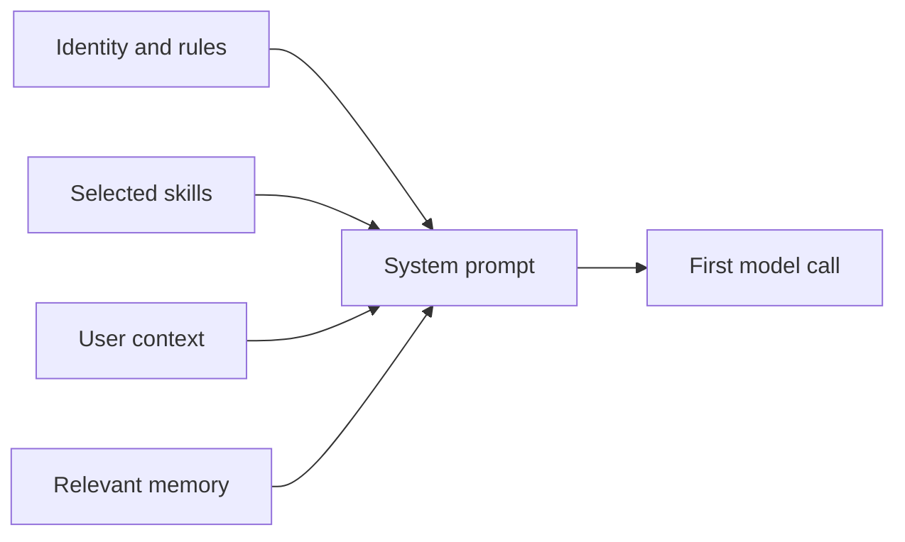

# Step 5 — Bootstrap Prompt and Core Skills

**Knowledge depth: 7/10**

Before assembling a prompt, read [07 — Bootstrap, Skills & Memory](../07-bootstrap-skills-memory.md). It explains GoClaw's agent context files and startup seeding. Read [14 — Skills Runtime](../14-skills-runtime.md) and [15 — Core Skills System](../15-core-skills-system.md) when you are ready to understand how an instruction package becomes available to an agent.

## The prompt is assembled context

A robust system prompt is not a single hard-coded string. It is a controlled composition of identity, operating rules, workspace context, selected skill guidance, user information, and small retrieved memory.



GoClaw uses bootstrap templates such as `SOUL.md`, `IDENTITY.md`, `AGENTS.md`, and `TOOLS.md`. The important idea is not the filenames; it is that stable instructions are versioned, inspectable, and separated from a user's changing conversation.

## Build a simple prompt composition order

```text
1. system identity and non-negotiable behavior
2. agent-specific instructions
3. current user/context facts
4. selected skill instructions
5. concise memory references
6. session history and the current user message
```

This ordering explains what is stable and what is transient. It also makes prompt debugging practical: log which sections were included and how much context budget each section consumed.

## What a skill is

A skill is a packaged unit of domain guidance, often a `SKILL.md` plus supporting files or scripts. It is not a new Go function and it does not bypass tool policy. A skill changes what the model knows about a task; the runtime still decides what actions are allowed.

## Read selectively

Do not load every skill into every prompt. Start with a skill selector that returns only the few instructions relevant to the current request. GoClaw's skills subsystem supplies a useful reference for discovery and access control; Step 19 covers publishing and lifecycle management.

