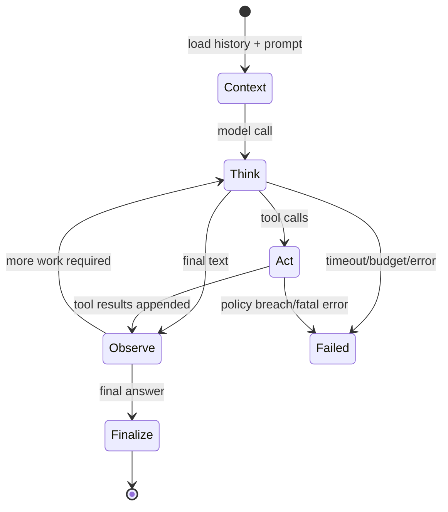

# Step 6 — Agent Orchestration Loop

**Knowledge depth: 9/10**  

Before writing the loop, read [01 — Agent Loop](../01-agent-loop.md). Keep [03 — Tools System](../03-tools-system.md) nearby for tool-call behavior and [07 — Bootstrap, Skills & Memory](../07-bootstrap-skills-memory.md) for the context that enters the first model call.

## Theory: an agent loop is a state machine

An LLM call alone is not an agent. An agent observes state, proposes actions, executes only authorized actions, feeds observations back to the model, and stops under explicit limits.



GoClaw makes this state machine explicit in `internal/pipeline`: stateless stages receive mutable per-run `RunState`. `Pipeline.Run` has setup, iteration, and finalization lists; `BreakLoop` completes normally while `AbortRun` stops early. That is a strong design to copy.

## Context budget is a safety property

For every model call, reserve room for output and tool schemas:

```text
history budget = context window
               - system prompt tokens
               - tool schema tokens
               - max output tokens
               - safety reserve
```

Do not wait for the provider to reject an oversized request. Prune or summarize before `Think`.

## A complete minimal runner

This runner is intentionally sequential. Step 8 adds safe parallel reads only after your tool policy can classify tools.

```go
type Runner struct {
	Provider model.Provider
	Sessions SessionStore
	Tools    tools.Executor
	Config   Config
}

type Config struct { MaxIterations, MaxToolCalls, MaxTokens int }

func (r *Runner) Run(ctx context.Context, in RunRequest) (RunResult, error) {
	history, summary, err := r.Sessions.Load(ctx, in.SessionKey)
	if err != nil { return RunResult{}, fmt.Errorf("load session: %w", err) }

	msgs := buildPrompt(summary, history, in.Message)
	if err := r.Sessions.Append(ctx, in.SessionKey, model.Message{Role: "user", Content: in.Message}); err != nil {
		return RunResult{}, fmt.Errorf("persist user turn: %w", err)
	}

	var result RunResult
	for iteration := 0; iteration < r.Config.MaxIterations; iteration++ {
		msgs = pruneToBudget(msgs, r.Config.MaxTokens)
		resp, err := r.Provider.Chat(ctx, model.ChatRequest{
			Messages: msgs, Tools: r.Tools.Definitions(), MaxTokens: r.Config.MaxTokens,
		})
		if err != nil { return result, fmt.Errorf("think iteration %d: %w", iteration, err) }
		result.Usage = addUsage(result.Usage, resp.Usage)
		result.Iterations = iteration + 1

		assistant := model.Message{Role: "assistant", Content: resp.Content, ToolCalls: resp.ToolCalls}
		msgs = append(msgs, assistant)
		if len(resp.ToolCalls) == 0 {
			if err := r.Sessions.Append(ctx, in.SessionKey, assistant); err != nil {
				return result, fmt.Errorf("persist answer: %w", err)
			}
			result.Content = resp.Content
			return result, nil
		}

		if result.ToolCalls+len(resp.ToolCalls) > r.Config.MaxToolCalls {
			return result, fmt.Errorf("tool-call limit exceeded")
		}
		if err := r.Sessions.Append(ctx, in.SessionKey, assistant); err != nil {
			return result, fmt.Errorf("persist tool request: %w", err)
		}

		for _, call := range resp.ToolCalls {
			toolMsg := r.Tools.Execute(ctx, in, call)
			msgs = append(msgs, toolMsg)
			if err := r.Sessions.Append(ctx, in.SessionKey, toolMsg); err != nil {
				return result, fmt.Errorf("persist tool result: %w", err)
			}
			result.ToolCalls++
		}
	}
	return result, fmt.Errorf("iteration limit exceeded")
}
```

## Production refinements from GoClaw

| Concern | Reference design |
|---|---|
| Pipeline state | `internal/pipeline/run_state.go`; state is per run |
| Stage contracts | `internal/pipeline/stage.go` |
| Tool parallelism | raw I/O can run in parallel, state mutation remains ordered |
| Finalization | uses `context.WithoutCancel` to persist safe final state after disconnect |
| Loop protection | `internal/agent/toolloop.go` detects repeated calls/results and read-only stalls |
| Intermediate output | callbacks emit block replies while final result stays authoritative |

## Failure policy

Classify errors. Do not turn every failure into a vague assistant reply.

| Condition | Action |
|---|---|
| caller cancelled | stop; finalize best-effort only |
| provider timeout | return retryable error; do not persist fictional answer |
| unknown tool | append a `tool` error message; let model recover |
| denied tool | append a policy error; audit it |
| tool panic | recover at registry boundary; append error |
| iteration/budget limit | return a clear partial-failure result |

The loop is the point where all earlier concepts meet: canonical messages, provider calls, prompts, and eventually tools. Keep it readable before adding parallelism or secondary agents.
