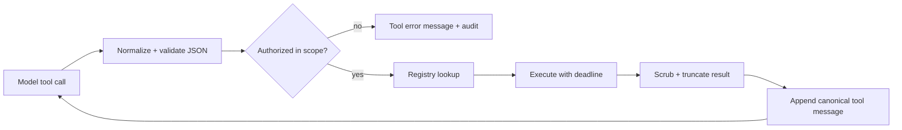

# Step 10 — Tool Registry and Authorization

**Knowledge depth: 9/10**  

Study [03 — Tools System](../03-tools-system.md) before adding capabilities beyond a simple read-only tool. Read the related controls in [09 — Security](../09-security.md); for command execution, learn [19 — Credentialed Exec](../19-credentialed-exec.md) rather than exposing a raw shell.

## Theory: tools cross the trust boundary

The model may propose a tool call, but it is not allowed to execute it. Your runtime must independently validate the name, JSON shape, user/tenant scope, capability policy, rate limit, and resource boundary.



GoClaw’s `Tool` interface is defined in `internal/tools/types.go`. `Registry` owns registration, aliases, capability metadata, rate limits, context injection, panic recovery, credential scrubbing, and deterministic provider definitions. This is the right responsibility boundary.

## Complete minimal contract and registry

```go
package tools

type Capability string
const (
	Read Capability = "read"
	Write Capability = "write"
	Network Capability = "network"
	Exec Capability = "exec"
)

type Result struct { Content string; IsError bool }
type Tool interface {
	Name() string
	Description() string
	Parameters() map[string]any
	Capabilities() []Capability
	Execute(context.Context, map[string]any) Result
}

type Policy interface { Allow(ctx context.Context, t Tool, args map[string]any) error }

type Registry struct { tools map[string]Tool; policy Policy }
func NewRegistry(p Policy) *Registry { return &Registry{tools: map[string]Tool{}, policy: p} }
func (r *Registry) Register(t Tool) error {
	if t.Name() == "" { return errors.New("tool name is required") }
	if _, exists := r.tools[t.Name()]; exists { return fmt.Errorf("duplicate tool %q", t.Name()) }
	r.tools[t.Name()] = t; return nil
}
func (r *Registry) Definitions() []model.ToolDefinition {
	names := make([]string, 0, len(r.tools)); for n := range r.tools { names = append(names, n) }
	sort.Strings(names)
	defs := make([]model.ToolDefinition, 0, len(names))
	for _, n := range names { t := r.tools[n]; defs = append(defs, model.ToolDefinition{Name:t.Name(), Description:t.Description(), Parameters:t.Parameters()}) }
	return defs
}
func (r *Registry) Execute(ctx context.Context, in agent.RunRequest, call model.ToolCall) (msg model.Message) {
	t, ok := r.tools[call.Name]
	if !ok { return toolError(call, "unknown tool") }
	if call.ID == "" || call.Arguments == nil { return toolError(call, "invalid tool call") }
	if err := r.policy.Allow(ctx, t, call.Arguments); err != nil { return toolError(call, "denied: "+err.Error()) }
	defer func() { if v := recover(); v != nil { msg = toolError(call, fmt.Sprintf("tool panicked: %v", v)) } }()
	callCtx, cancel := context.WithTimeout(ctx, 30*time.Second); defer cancel()
	result := t.Execute(callCtx, call.Arguments)
	return model.Message{Role:"tool", ToolCallID:call.ID, ToolName:call.Name, Content:truncate(scrub(result.Content), 32<<10), IsError:result.IsError}
}
```

The code is deliberately explicit: a result is always converted to a canonical `role="tool"` message, including policy failure. That gives the model a chance to choose another safe path.

## Policy layering

Use intersection, not “last setting wins”:

```text
registered tool
∩ global deployment policy
∩ tenant policy
∩ agent allow-list
∩ current channel/workspace policy
∩ user approval (when required)
```

Example policy decisions:

| Tool | Default | Extra condition |
|---|---|---|
| `datetime` | allow | none |
| `memory_search` | allow | same memory scope |
| `web_fetch` | allow with SSRF guard | allowed host/IP only |
| `read_file` | allow | resolved path stays under workspace |
| `write_file` | require approval | workspace-only path |
| `exec` | deny / sandbox | command policy and explicit approval |
| `message` | require approval | same tenant/channel authorization |

## Execution details that prevent incidents

- Validate JSON Schema before `Execute`; never rely on the model to supply correct types.
- Put scope values in immutable context or an explicit input struct—not mutable fields on singleton tool instances.
- Strip credentials from user-visible and model-visible outputs.
- Bound output bytes and identify truncation; giant tool output can consume the entire prompt.
- Keep tool-call IDs intact for provider protocol pairing.
- Parallelize only independent **read-only** tool I/O. Append results in the model’s original call order. GoClaw’s pipeline has this split raw-I/O / ordered-state design.
- Detect repeated calls and identical results. See `internal/agent/toolloop.go` for a useful multi-signal guard.

## First tools

Implement `datetime` and a scope-safe `memory_search` first. Add filesystem, network, shell, browser, MCP, and delegate tools only after their policy and audit requirements are designed.

Tools are where a language model touches the outside world. The registry is therefore an execution boundary, not a convenience map of functions.
