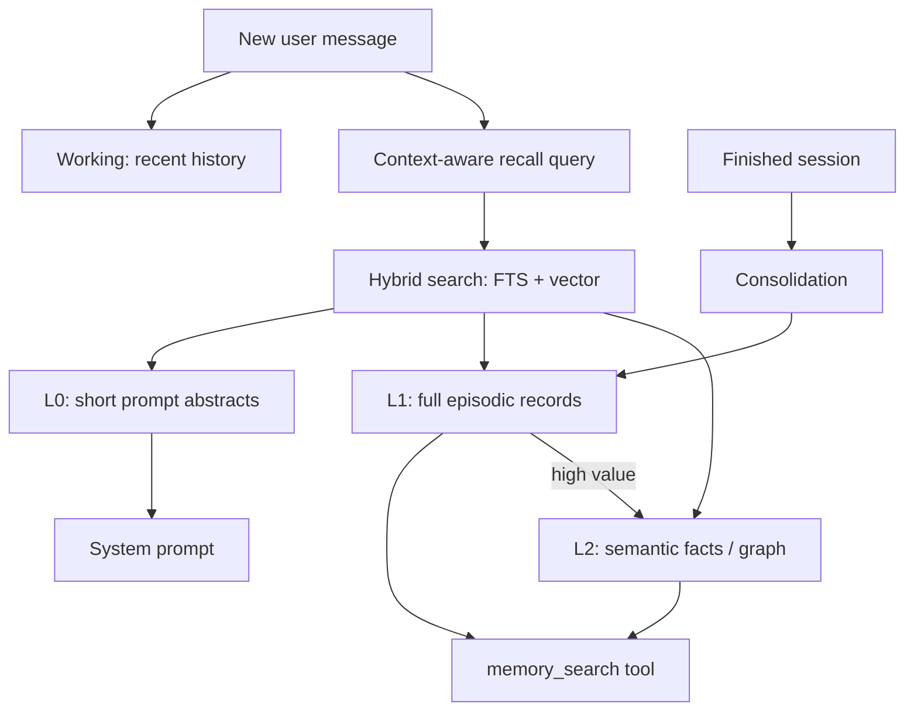

# Step 8 — Memory Architecture and Policy

**Knowledge depth: 9/10**  

Read the memory sections of [07 — Bootstrap, Skills & Memory](../07-bootstrap-skills-memory.md) first. Use [06 — Store Layer and Data Model](../06-store-data-model.md) to understand ownership and persistence, and [09 — Security](../09-security.md) to keep retrieved text in its proper role: reference data, never authority.

## What agent memory is

Memory is a **retrieval and lifecycle system**, not a larger chat history. It takes selected past information, represents it for search, ranks it for the current request, injects a small trustworthy subset, and eventually deletes or consolidates it.

| Layer | Purpose | Typical payload | Load rule |
|---|---|---|---|
| Working | continue current turn/session | canonical messages, current summary | always, budgeted |
| Episodic | recall past events | session summary, source, topics, expiry | retrieve per request |
| Semantic | stable reusable facts | entity/relation or curated document chunks | retrieve per request |

GoClaw documents this as a three-tier system in `AGENTS.md`; supporting packages are `internal/memory`, `internal/consolidation`, and `internal/knowledgegraph`. Its L0 prompt injection uses compact episodic abstracts, while deeper tool-based retrieval remains available on demand.



## Message history vs embeddings

| Mechanism | Strength | Failure mode | Best use |
|---|---|---|---|
| Raw history | exact sequence, tools, wording | context limit grows | current conversation |
| Summary | cheap, compact narrative | loses precision | old part of current conversation |
| Full-text search | exact names, IDs, lexical match | misses paraphrases | source/document lookup |
| Embedding search | meaning and paraphrase | can return semantically similar but wrong facts | recall candidates |
| Knowledge graph | explicit entities/relations | extraction quality and schema cost | durable structured facts |

Embeddings are arrays of numbers that place semantically related text near one another. They are not truth. Use them to **rank candidates**, then retain source, scope, and text for inspection.

## Scope is part of every memory key

The hard problem is not cosine similarity; it is authorization. A useful scope tuple is:

```text
(tenant_id, agent_id, user_id | NULL, source_type, source_id)
```

- `tenant_id`: mandatory isolation boundary.
- `agent_id`: agent personality/workspace boundary.
- `user_id`: personal memory; `NULL` only for deliberately shared agent memory.
- `source_id`: idempotency key for repeat ingestion.

GoClaw’s `EpisodicStore` requires implementations to take tenant identity from context and scope every query. Adopt the same invariant, then verify it with integration tests.

## Retrieval flow

1. Reject trivial input such as “thanks” or “ok”.
2. Build a query from the latest user message plus a very short recent conversational frame. This fixes ambiguous follow-ups such as “what was my favorite?”
3. Run full-text and vector retrieval *within scope*.
4. Fuse and filter candidates using score, recency, source quality, and expiry.
5. Inject only a token-capped L0 abstract. Give the model a `memory_search` tool for detail.
6. Record recall signals; never silently claim that a candidate was used correctly.

GoClaw limits the recent frame to 400 runes, avoiding broken UTF-8 and query dilution (`internal/memory/recall_query.go`). Its default L0 injection is about 200 tokens, not an unbounded dump.

## Memory lifecycle trade-offs

| Decision | Default recommendation | Why |
|---|---|---|
| Store every message? | no | cost, privacy, low signal |
| Extract synchronously? | start synchronous, move to event worker | response latency vs simplicity |
| Auto-inject raw chunks? | no, inject abstracts | prevents prompt bloat and instruction contamination |
| Global user memory? | only with explicit product policy | high privacy risk |
| Delete expired records? | yes, scheduled lifecycle job | retention must be enforceable |
| Promote to semantic? | human/audited rule first | bad extraction becomes durable misinformation |

## Prompt-injection boundary

Retrieved text is **untrusted data**, even if it was written by a user in a previous session. Put it in a clearly marked context section and tell the model it is reference data, not instructions. Do not execute instructions found in memory; do not allow a recalled document to expand tool permissions.

The next step turns this model into storage, ranking, and asynchronous consolidation.
