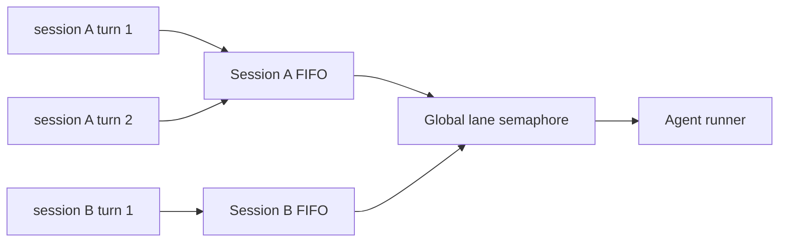

# Step 11 — Session Scheduler and Background Events

**Knowledge depth: 7/10**  

Read [08 — Scheduling & Cron](../08-scheduling-cron.md) before adding goroutines or queues. [10 — Tracing & Observability](../10-tracing-observability.md) explains how asynchronous runs remain visible. Read [22 — Heartbeat System](../22-heartbeat-system.md) to understand GoClaw's scheduled autonomy, but do not implement cron or heartbeat in this course.

## The concurrency problem

Two turns for the same session must not read the same old history and then overwrite each other. But one slow session must not block all users. The answer is a **per-session queue** plus a **global concurrency limit**.



GoClaw implements this in `internal/scheduler`: queues are keyed by session; lanes independently cap main, subagent, and cron work. Here, implement only one `main` lane, cancellation, and a draining state for shutdown.

## Minimal keyed scheduler

```go
type Job func(context.Context) error
type Scheduler struct {
	mu sync.Mutex
	queues map[string]chan Job
	sem chan struct{}
	root context.Context
}

func New(maxConcurrent int) *Scheduler {
	return &Scheduler{queues: make(map[string]chan Job), sem: make(chan struct{}, maxConcurrent), root: context.Background()}
}

func (s *Scheduler) Submit(key string, job Job) {
	s.mu.Lock()
	q := s.queues[key]
	if q == nil {
		q = make(chan Job, 64); s.queues[key] = q
		go s.consume(key, q)
	}
	s.mu.Unlock()
	q <- job
}

func (s *Scheduler) consume(key string, q <-chan Job) {
	for job := range q {
		s.sem <- struct{}{}
		func() { defer func(){ <-s.sem }(); _ = job(s.root) }()
	}
}
```

For a production version, return a result channel, enforce queue size/backpressure, attach a cancellable run context, expire inactive queues, log queue wait time, and do not discard job errors as this teaching skeleton does.

## Domain events are not chat messages

Use events for asynchronous facts such as “session summarized” and “episode ready to index”. Do not make a request wait for background memory consolidation. Team tasks, credential revocation, cron, and heartbeat remain GoClaw reference topics.

```go
type Event struct { Type, SourceID string; Payload any }
type Handler func(context.Context, Event) error

type Bus interface {
	Publish(Event)             // non-blocking, may be lossy by design
	Subscribe(kind string, h Handler) (unsubscribe func())
	Start(context.Context)
	Drain(timeout time.Duration) error
}
```

The GoClaw `DomainEventBus` has a bounded queue, typed event names, worker pool, `SourceID` deduplication, retries with exponential delay, panic recovery, and shutdown draining. See `internal/eventbus/domain_event_bus.go` and `bus_impl.go`.

## Delivery semantics

| Work | Recommended semantic | Design |
|---|---|---|
| Chat turn | ordered, at-most-once per queued job | session queue + idempotency key |
| Memory index | at-least-once | event retry + unique source ID |
| WebSocket notification | best effort | replayable state query is the recovery path |
| Future channel send | at-least-once risk | study only; provider idempotency key where available |

Avoid claiming exactly-once delivery. In a crash between a database commit and an HTTP call, it is usually impossible without a transactional outbox and receiver support.

## Graceful shutdown

```text
1. stop accepting HTTP/WS work
2. mark scheduler draining
3. let bounded active runs finish or cancel after deadline
4. drain durable-worthy background events
5. close database and network clients
```

The pipeline may use a cancellation-free context only for safe final persistence. Never use it to continue model calls or risky tools after a client cancellation.

With a scheduler in place, the same agent runtime can be safely reached through the gateway rather than only through local code.
