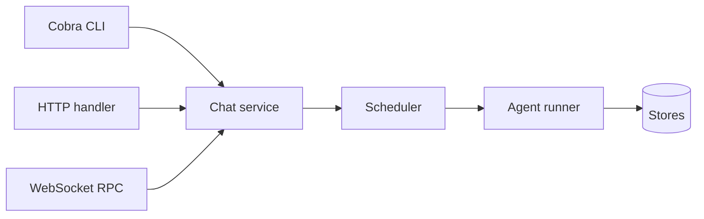

# Step 13 — CLI and HTTP API

**Knowledge depth: 7/10**  

Read [04 — Gateway and Protocol](../04-gateway-protocol.md) for the gateway boundary and [18 — HTTP REST API](../18-http-api.md) for HTTP contracts. This step keeps WebSocket details for Step 14; [20 — API Keys & Authentication](../20-api-keys-auth.md) provides the shared authentication context.

## One application service, three adapters



Do not put agent behavior in handlers. A transport should authenticate, parse, validate, construct a `RunRequest`, schedule it, and serialize a result.

GoClaw starts from `main.go → cmd.Execute()`. Gateway composition is in `cmd/gateway.go`; `internal/gateway/server.go` builds `/ws`, `/health`, `/v1/chat/completions`, `/v1/responses`, and registered API handlers. The CLI uses Cobra commands under `cmd/`.

## Minimal HTTP endpoint

```go
type ChatHandler struct { scheduler *runtime.Scheduler }
type chatInput struct { AgentID, SessionKey, Message string }

func (h *ChatHandler) ServeHTTP(w http.ResponseWriter, r *http.Request) {
	if r.Method != http.MethodPost { http.Error(w, "method not allowed", 405); return }
	identity, err := authenticate(r)
	if err != nil { http.Error(w, "unauthorized", 401); return }
	defer r.Body.Close()
	var in chatInput
	if err := json.NewDecoder(io.LimitReader(r.Body, 1<<20)).Decode(&in); err != nil {
		http.Error(w, "invalid JSON", 400); return
	}
	if strings.TrimSpace(in.Message) == "" || in.SessionKey == "" { http.Error(w, "message and session_key required", 400); return }
	out := h.scheduler.Schedule(r.Context(), "main", agent.RunRequest{
		TenantID: identity.TenantID, UserID: identity.UserID, AgentID: in.AgentID,
		SessionKey: in.SessionKey, Message: in.Message,
	})
	select {
	case result := <-out:
		if result.Err != nil { http.Error(w, result.Err.Error(), 502); return }
		w.Header().Set("Content-Type", "application/json")
		_ = json.NewEncoder(w).Encode(result.Value)
	case <-r.Context().Done:
		return
	}
}
```

## CLI shape

```text
agentkit serve
agentkit chat --agent research --session demo "summarize this"
agentkit migrate up
agentkit providers verify default
```

The `chat` command should call the local HTTP/WS service rather than construct a second agent runtime. This ensures operator behavior has the same policy, persistence, and observability as UI traffic.

The CLI and HTTP API are two translations of the same application service. Keep that relationship clear before adding a persistent WebSocket connection in the next step.
