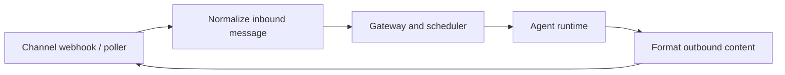

# Step 15 — Channel Connectors and Message Delivery

**Knowledge depth: 7/10**

Read [05 — Channels and Messaging](../05-channels-messaging.md) before connecting Telegram, Discord, WhatsApp, Slack, or another platform. It is the source for GoClaw's channel abstraction, message normalization, pairing, formatting, and reply routing.

## A channel is another transport adapter

The agent should not know whether a message came from a browser, a CLI, or Telegram. A connector translates external events into a canonical inbound message and translates the final result back to the channel's formatting and delivery rules.

## Normalize before the agent sees it

An inbound message needs a stable channel name, external user ID, chat ID, peer kind, text, media references, and reply context. These values determine the session key and return route. Provider-specific or channel-specific JSON should stop at the connector boundary.

## Delivery is platform-specific

Channels differ in Markdown support, message size, typing indicators, threads, attachments, and edit behavior. GoClaw's Telegram formatting pipeline is a good example: sanitize model output, transform formatting, split safely, then send. Keep this complexity outside the agent loop.

## Add channels late

Channels multiply identity and delivery cases. Add the first connector only after the core HTTP/WS path is understandable. A web chat interface in Steps 20–22 is the fastest place to learn the runtime before taking on external platform behavior.

