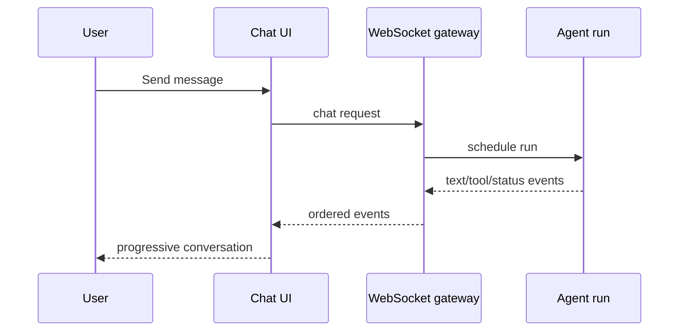

# Step 16 — Chat UI, Run Timeline, and GoClaw Architecture Review

**Knowledge depth: 8/10**

Read the streaming and message-flow sections in [01 — Agent Loop](../01-agent-loop.md), then revisit [19 — WebSocket RPC Methods](../19-websocket-rpc.md). Read [10 — Tracing & Observability](../10-tracing-observability.md) to understand the run timeline. [13 — WebSocket Team & Delegation Events](../13-ws-team-events.md) is useful architecture reading, even though this project does not implement teams.

## The chat page is a run timeline

A useful agent chat interface shows more than a final bubble. It makes a run understandable without overwhelming the user: submitted prompt, streaming answer, meaningful tool activity, attachments, errors, and completion state.



## Model the states deliberately

The composer can be idle, submitting, streaming, waiting for approval, or cancelled. A message can be pending, complete, failed, or interrupted. Naming these states explicitly prevents visual glitches such as an old session's stream appearing in a newly selected session.

## Render content safely

Assistant output is untrusted. Render Markdown through a sanitizer, show code and tables readably, and treat generated links/files as data that may require server-side authorization. Tool details should be progressively disclosed: a concise status in the transcript and full arguments/results in an inspectable panel.

## Reconnection behavior

On reconnect, reload the authoritative session history, then resume listening to new events. Do not assume the browser received every delta. This is why Step 13 defined events as a view over durable state.

## A small management surface

Complete the student UI with a session sidebar, an agent settings panel, a compact memory view, and a run-detail drawer. The run detail connects an answer to its model usage, tool calls, and retrieved memory. This is enough operational visibility for a project demo without recreating GoClaw's full administration application.

```text
Chat page
├── session list and new-session action
├── streaming transcript and composer
├── expandable tool / memory activity
├── run timeline drawer
└── agent settings: model, system prompt, enabled tools
```

## Learn the larger GoClaw architecture without implementing it

The remaining author documents describe valuable production ideas that are intentionally outside this course's build scope. Read [05 — Channels and Messaging](../05-channels-messaging.md) to see how a connector isolates Telegram, WhatsApp, Zalo, and similar platforms from the core runtime. Read [11 — Agent Teams](../11-agent-teams.md) for durable delegation and task ownership rather than trying to spawn untracked child agents.

For the full skill lifecycle, read [14 — Skills Runtime](../14-skills-runtime.md), [15 — Core Skills System](../15-core-skills-system.md), and [16 — Skill Publishing System](../16-skill-publishing.md). [21 — Agent Evolution and Skill Management](../21-agent-evolution-and-skill-management.md) explains why self-adaptation needs metrics, approval, and rollback.

Finally, use [18 — ACP Provider](../18-acp-provider.md), [19 — Credentialed Exec](../19-credentialed-exec.md), and [22 — Heartbeat System](../22-heartbeat-system.md) as extension studies. They show why process-based providers, privileged local commands, and autonomous schedules demand more lifecycle management than a stable student project should carry.

The goal is not to recreate every GoClaw feature. It is to understand where each feature belongs, build the essential agentic path well, and leave clear seams for future work.
