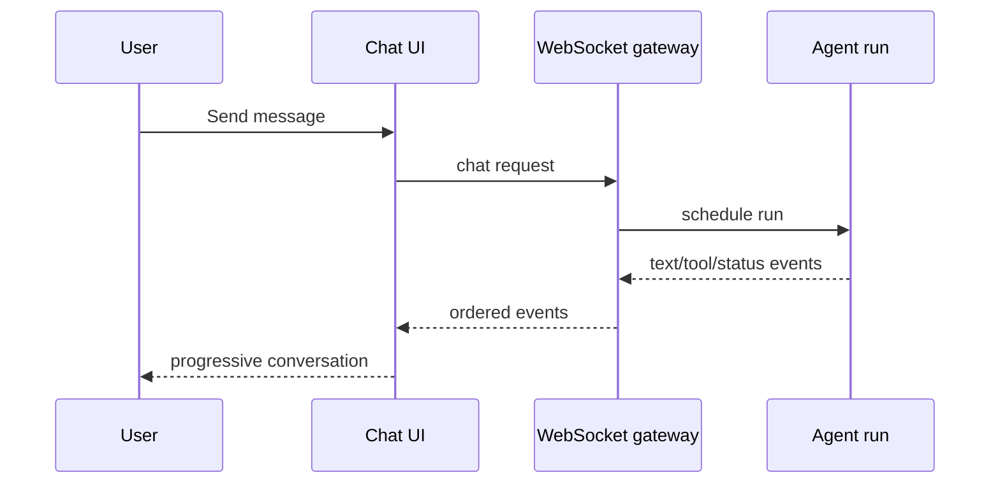

# Step 21 — Chat Interface and Realtime Streaming

**Knowledge depth: 8/10**

Read the streaming and message-flow sections in [01 — Agent Loop](../01-agent-loop.md), then revisit [19 — WebSocket RPC Methods](../19-websocket-rpc.md). [13 — WebSocket Team & Delegation Events](../13-ws-team-events.md) becomes useful when the chat needs to surface progress beyond text tokens.

## The chat page is a run timeline

A useful agent chat interface shows more than a final bubble. It makes a run understandable without overwhelming the user: submitted prompt, streaming answer, meaningful tool activity, attachments, errors, and completion state.

## Model the states deliberately

The composer can be idle, submitting, streaming, waiting for approval, or cancelled. A message can be pending, complete, failed, or interrupted. Naming these states explicitly prevents visual glitches such as an old session's stream appearing in a newly selected session.

## Render content safely

Assistant output is untrusted. Render Markdown through a sanitizer, show code and tables readably, and treat generated links/files as data that may require server-side authorization. Tool details should be progressively disclosed: a concise status in the transcript and full arguments/results in an inspectable panel.

## Reconnection behavior

On reconnect, reload the authoritative session history, then resume listening to new events. Do not assume the browser received every delta. This is why Step 14 defined events as a view over durable state.

